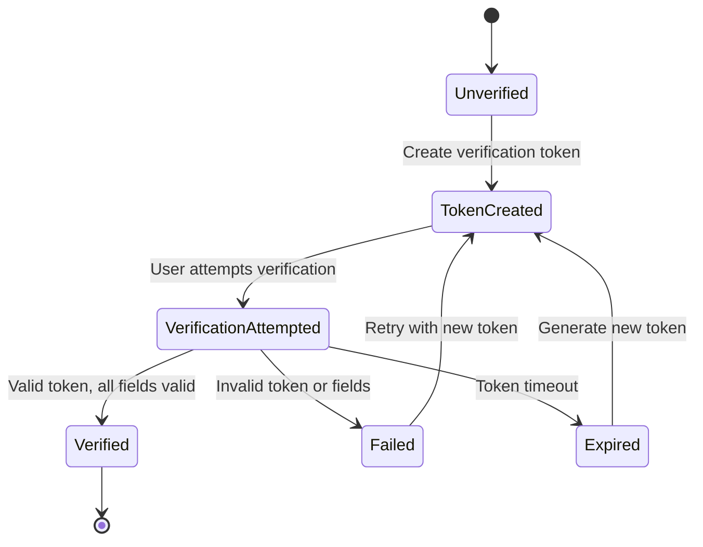

# Supabase Verification System Revision Plan

## Executive Summary

This document outlines a comprehensive revision of the FixRez AI verification system to ensure accurate verification status tracking with strict validation, proper error handling, and audit logging. The revision addresses current gaps in verification field management and implements robust safeguards against unauthorized verification status changes.

## Current System Analysis

### Existing Verification Fields
Based on the codebase analysis, the current system includes:

1. **profiles table**: Contains basic verification fields
2. **verification_tokens table**: Manages verification tokens
3. **verification_logs table**: Basic logging (if exists)

### Identified Issues
1. **Field Inconsistency**: Verification fields may not be properly synchronized
2. **Missing Constraints**: No database-level validation to prevent invalid verification states
3. **Limited Audit Trail**: Insufficient logging for verification status changes
4. **Token Management**: Potential gaps in token expiration and validation

## Database Schema Updates

### 1. Enhanced Profiles Table
```sql
-- Enhanced profiles table with strict verification fields
ALTER TABLE profiles ADD COLUMN IF NOT EXISTS verified BOOLEAN DEFAULT FALSE;
ALTER TABLE profiles ADD COLUMN IF NOT EXISTS verification_timestamp TIMESTAMPTZ;
ALTER TABLE profiles ADD COLUMN IF NOT EXISTS verification_method TEXT CHECK (verification_method IN ('email', 'phone', 'admin', 'oauth'));
ALTER TABLE profiles ADD COLUMN IF NOT EXISTS verification_token_id UUID;
ALTER TABLE profiles ADD COLUMN IF NOT EXISTS verification_metadata JSONB DEFAULT '{}';

-- Add foreign key constraint for verification token
ALTER TABLE profiles 
ADD CONSTRAINT fk_verification_token 
FOREIGN KEY (verification_token_id) REFERENCES verification_tokens(id) 
ON DELETE SET NULL;

-- Create composite index for verification queries
CREATE INDEX idx_profiles_verification_status ON profiles(verified, verification_timestamp, verification_method);
```

### 2. Enhanced Verification Tokens Table
```sql
-- Enhanced verification tokens table
ALTER TABLE verification_tokens ADD COLUMN IF NOT EXISTS used BOOLEAN DEFAULT FALSE;
ALTER TABLE verification_tokens ADD COLUMN IF NOT EXISTS used_at TIMESTAMPTZ;
ALTER TABLE verification_tokens ADD COLUMN IF NOT EXISTS attempts INTEGER DEFAULT 0;
ALTER TABLE verification_tokens ADD COLUMN IF NOT EXISTS max_attempts INTEGER DEFAULT 3;
ALTER TABLE verification_tokens ADD COLUMN IF NOT EXISTS metadata JSONB DEFAULT '{}';

-- Add expiration constraint
ALTER TABLE verification_tokens 
ADD CONSTRAINT chk_token_expiration 
CHECK (expires_at > created_at);

-- Create index for active token queries
CREATE INDEX idx_verification_tokens_active ON verification_tokens(user_id, type, used, expires_at) 
WHERE used = FALSE AND expires_at > NOW();
```

### 3. Comprehensive Audit Log Table
```sql
-- Create detailed verification audit log table
CREATE TABLE IF NOT EXISTS verification_audit_log (
    id UUID PRIMARY KEY DEFAULT gen_random_uuid(),
    user_id UUID NOT NULL REFERENCES auth.users(id) ON DELETE CASCADE,
    action TEXT NOT NULL CHECK (action IN ('created', 'attempted', 'verified', 'expired', 'failed', 'revoked')),
    verification_token_id UUID REFERENCES verification_tokens(id) ON DELETE SET NULL,
    verification_method TEXT CHECK (verification_method IN ('email', 'phone', 'admin', 'oauth')),
    ip_address INET,
    user_agent TEXT,
    metadata JSONB DEFAULT '{}',
    error_message TEXT,
    created_at TIMESTAMPTZ DEFAULT NOW(),
    created_by UUID REFERENCES auth.users(id) ON DELETE SET NULL
);

-- Create indexes for audit log queries
CREATE INDEX idx_verification_audit_user ON verification_audit_log(user_id, created_at DESC);
CREATE INDEX idx_verification_audit_token ON verification_audit_log(verification_token_id);
CREATE INDEX idx_verification_audit_action ON verification_audit_log(action, created_at DESC);
```

## Verification Workflow Design

### 1. Verification State Machine


### 2. Verification Process Flow
```sql
-- Create or replace verification function with strict validation
CREATE OR REPLACE FUNCTION create_verification_token(
    p_user_id UUID,
    p_type TEXT,
    p_method TEXT,
    p_expires_in_minutes INTEGER DEFAULT 60
)
RETURNS UUID AS $$
DECLARE
    token_uuid UUID;
    token_hash TEXT;
    plain_token TEXT;
BEGIN
    -- Validate inputs
    IF p_type NOT IN ('email', 'phone', 'password_reset') THEN
        RAISE EXCEPTION 'Invalid verification type: %', p_type;
    END IF;
    
    IF p_method NOT IN ('email', 'phone', 'admin') THEN
        RAISE EXCEPTION 'Invalid verification method: %', p_method;
    END IF;
    
    -- Generate secure token
    token_uuid := gen_random_uuid();
    plain_token := encode(gen_random_bytes(32), 'hex');
    token_hash := crypt(plain_token, gen_salt('bf'));
    
    -- Insert token with validation
    INSERT INTO verification_tokens (
        id, user_id, type, token_hash, expires_at, 
        created_at, method, max_attempts
    )
    VALUES (
        token_uuid, p_user_id, p_type, token_hash, 
        NOW() + (p_expires_in_minutes || ' minutes')::INTERVAL,
        NOW(), p_method, 3
    );
    
    -- Log token creation
    INSERT INTO verification_audit_log (
        user_id, action, verification_token_id, 
        verification_method, metadata
    )
    VALUES (
        p_user_id, 'created', token_uuid, p_method,
        jsonb_build_object('type', p_type, 'expires_in_minutes', p_expires_in_minutes)
    );
    
    RETURN token_uuid;
END;
$$ LANGUAGE plpgsql SECURITY DEFINER;
```

## Validation Constraints

### 1. Database-Level Constraints
```sql
-- Create verification validation function
CREATE OR REPLACE FUNCTION validate_verification_completion()
RETURNS TRIGGER AS $$
BEGIN
    -- Only allow verified = true if all required fields are present
    IF NEW.verified = TRUE THEN
        IF NEW.verification_timestamp IS NULL THEN
            RAISE EXCEPTION 'verification_timestamp is required when verified = true';
        END IF;
        
        IF NEW.verification_method IS NULL THEN
            RAISE EXCEPTION 'verification_method is required when verified = true';
        END IF;
        
        IF NEW.verification_token_id IS NULL THEN
            RAISE EXCEPTION 'verification_token_id is required when verified = true';
        END IF;
        
        -- Verify the token exists and is valid
        IF NOT EXISTS (
            SELECT 1 FROM verification_tokens 
            WHERE id = NEW.verification_token_id 
            AND user_id = NEW.id 
            AND used = TRUE
        ) THEN
            RAISE EXCEPTION 'Invalid or unused verification token';
        END IF;
    END IF;
    
    -- Prevent setting verification fields when verified = false
    IF NEW.verified = FALSE THEN
        IF NEW.verification_timestamp IS NOT NULL OR 
           NEW.verification_method IS NOT NULL OR 
           NEW.verification_token_id IS NOT NULL THEN
            RAISE EXCEPTION 'Verification fields must be null when verified = false';
        END IF;
    END IF;
    
    RETURN NEW;
END;
$$ LANGUAGE plpgsql;

-- Create trigger for verification validation
CREATE TRIGGER trg_validate_verification
    BEFORE UPDATE OF verified, verification_timestamp, verification_method, verification_token_id
    ON profiles
    FOR EACH ROW
    EXECUTE FUNCTION validate_verification_completion();
```

### 2. Verification Token Validation Function
```sql
-- Enhanced verification function with strict validation
CREATE OR REPLACE FUNCTION verify_user_token(
    p_user_id UUID,
    p_plain_token TEXT,
    p_ip_address INET DEFAULT NULL,
    p_user_agent TEXT DEFAULT NULL
)
RETURNS TABLE(success BOOLEAN, message TEXT) AS $$
DECLARE
    v_token_record RECORD;
    v_attempts_remaining INTEGER;
BEGIN
    -- Validate inputs
    IF p_user_id IS NULL OR p_plain_token IS NULL THEN
        RETURN QUERY SELECT FALSE, 'Missing required parameters';
        RETURN;
    END IF;
    
    -- Get token record
    SELECT * INTO v_token_record
    FROM verification_tokens
    WHERE user_id = p_user_id 
    AND used = FALSE 
    AND expires_at > NOW()
    ORDER BY created_at DESC
    LIMIT 1;
    
    -- Check if token exists
    IF v_token_record IS NULL THEN
        -- Log failed attempt
        INSERT INTO verification_audit_log (
            user_id, action, ip_address, user_agent, 
            error_message
        )
        VALUES (
            p_user_id, 'failed', p_ip_address, p_user_agent,
            'No valid token found'
        );
        
        RETURN QUERY SELECT FALSE, 'No valid verification token found';
        RETURN;
    END IF;
    
    -- Check if token is expired
    IF v_token_record.expires_at <= NOW() THEN
        INSERT INTO verification_audit_log (
            user_id, action, verification_token_id, 
            ip_address, user_agent, error_message
        )
        VALUES (
            p_user_id, 'expired', v_token_record.id,
            p_ip_address, p_user_agent, 'Token expired'
        );
        
        RETURN QUERY SELECT FALSE, 'Verification token has expired';
        RETURN;
    END IF;
    
    -- Check attempts remaining
    IF v_token_record.attempts >= v_token_record.max_attempts THEN
        INSERT INTO verification_audit_log (
            user_id, action, verification_token_id, 
            ip_address, user_agent, error_message
        )
        VALUES (
            p_user_id, 'failed', v_token_record.id,
            p_ip_address, p_user_agent, 'Maximum attempts exceeded'
        );
        
        RETURN QUERY SELECT FALSE, 'Maximum verification attempts exceeded';
        RETURN;
    END IF;
    
    -- Verify token
    IF crypt(p_plain_token, v_token_record.token_hash) = v_token_record.token_hash THEN
        -- Token is valid, mark as used
        UPDATE verification_tokens
        SET used = TRUE, used_at = NOW()
        WHERE id = v_token_record.id;
        
        -- Update profile verification status
        UPDATE profiles
        SET 
            verified = TRUE,
            verification_timestamp = NOW(),
            verification_method = v_token_record.method,
            verification_token_id = v_token_record.id
        WHERE id = p_user_id;
        
        -- Log successful verification
        INSERT INTO verification_audit_log (
            user_id, action, verification_token_id, 
            verification_method, ip_address, user_agent
        )
        VALUES (
            p_user_id, 'verified', v_token_record.id,
            v_token_record.method, p_ip_address, p_user_agent
        );
        
        RETURN QUERY SELECT TRUE, 'Verification successful';
        RETURN;
    ELSE
        -- Invalid token, increment attempts
        UPDATE verification_tokens
        SET attempts = attempts + 1
        WHERE id = v_token_record.id;
        
        v_attempts_remaining := v_token_record.max_attempts - v_token_record.attempts - 1;
        
        -- Log failed attempt
        INSERT INTO verification_audit_log (
            user_id, action, verification_token_id, 
            ip_address, user_agent, error_message, metadata
        )
        VALUES (
            p_user_id, 'attempted', v_token_record.id,
            p_ip_address, p_user_agent, 'Invalid token',
            jsonb_build_object('attempts_remaining', v_attempts_remaining)
        );
        
        RETURN QUERY SELECT FALSE, format('Invalid token. %s attempts remaining', v_attempts_remaining);
        RETURN;
    END IF;
END;
$$ LANGUAGE plpgsql SECURITY DEFINER;
```

## Error Handling Strategy

### 1. Error Categories and Handling
```sql
-- Create error handling types
CREATE TYPE verification_error_type AS ENUM (
    'missing_fields',
    'invalid_token',
    'expired_token',
    'max_attempts_exceeded',
    'already_verified',
    'database_error',
    'system_error'
);

-- Create error messages table
CREATE TABLE IF NOT EXISTS verification_error_messages (
    error_type verification_error_type PRIMARY KEY,
    user_message TEXT NOT NULL,
    technical_message TEXT,
    retry_allowed BOOLEAN DEFAULT TRUE,
    retry_delay_minutes INTEGER DEFAULT 0
);

-- Insert error messages
INSERT INTO verification_error_messages (error_type, user_message, technical_message, retry_allowed, retry_delay_minutes) VALUES
('missing_fields', 'Required information is missing. Please try again.', 'Missing required fields in verification request', TRUE, 0),
('invalid_token', 'Invalid verification code. Please check and try again.', 'Token validation failed', TRUE, 0),
('expired_token', 'Verification code has expired. A new code has been sent.', 'Token expired', TRUE, 0),
('max_attempts_exceeded', 'Too many failed attempts. Please try again later.', 'Maximum verification attempts exceeded', FALSE, 60),
('already_verified', 'Your account is already verified.', 'User already verified', FALSE, 0),
('database_error', 'System error. Please contact support.', 'Database operation failed', FALSE, 0),
('system_error', 'System error. Please contact support.', 'System error occurred', FALSE, 0);
```

### 2. Error Logging Function
```sql
-- Enhanced error logging function
CREATE OR REPLACE FUNCTION log_verification_error(
    p_user_id UUID,
    p_error_type verification_error_type,
    p_context JSONB DEFAULT '{}',
    p_ip_address INET DEFAULT NULL,
    p_user_agent TEXT DEFAULT NULL
)
RETURNS UUID AS $$
DECLARE
    error_id UUID;
    error_msg RECORD;
BEGIN
    -- Get error message details
    SELECT * INTO error_msg
    FROM verification_error_messages
    WHERE error_type = p_error_type;
    
    -- Generate error ID
    error_id := gen_random_uuid();
    
    -- Log the error
    INSERT INTO verification_audit_log (
        id, user_id, action, ip_address, user_agent, 
        error_message, metadata
    )
    VALUES (
        error_id, p_user_id, 'failed', p_ip_address, p_user_agent,
        error_msg.technical_message,
        jsonb_build_object(
            'error_type', p_error_type,
            'user_message', error_msg.user_message,
            'retry_allowed', error_msg.retry_allowed,
            'retry_delay_minutes', error_msg.retry_delay_minutes,
            'context', p_context
        )
    );
    
    RETURN error_id;
END;
$$ LANGUAGE plpgsql SECURITY DEFINER;
```

## Audit Logging Implementation

### 1. Audit Log Triggers
```sql
-- Create audit trigger for profile verification changes
CREATE OR REPLACE FUNCTION audit_verification_changes()
RETURNS TRIGGER AS $$
BEGIN
    -- Only log when verification status changes
    IF OLD.verified IS DISTINCT FROM NEW.verified OR
       OLD.verification_timestamp IS DISTINCT FROM NEW.verification_timestamp OR
       OLD.verification_method IS DISTINCT FROM NEW.verification_method OR
       OLD.verification_token_id IS DISTINCT FROM NEW.verification_token_id THEN
        
        INSERT INTO verification_audit_log (
            user_id, action, verification_token_id, verification_method,
            metadata
        )
        VALUES (
            NEW.id, 
            CASE 
                WHEN NEW.verified = TRUE THEN 'verified'
                WHEN OLD.verified = TRUE AND NEW.verified = FALSE THEN 'revoked'
                ELSE 'updated'
            END,
            NEW.verification_token_id,
            NEW.verification_method,
            jsonb_build_object(
                'old_verified', OLD.verified,
                'new_verified', NEW.verified,
                'old_timestamp', OLD.verification_timestamp,
                'new_timestamp', NEW.verification_timestamp,
                'old_method', OLD.verification_method,
                'new_method', NEW.verification_method,
                'change_type', 'profile_update'
            )
        );
    END IF;
    
    RETURN NEW;
END;
$$ LANGUAGE plpgsql;

-- Create trigger for profile verification changes
CREATE TRIGGER trg_audit_verification_changes
    AFTER UPDATE OF verified, verification_timestamp, verification_method, verification_token_id
    ON profiles
    FOR EACH ROW
    EXECUTE FUNCTION audit_verification_changes();
```

### 2. Audit Query Functions
```sql
-- Create function to get verification audit trail
CREATE OR REPLACE FUNCTION get_verification_audit_trail(
    p_user_id UUID,
    p_limit INTEGER DEFAULT 50,
    p_offset INTEGER DEFAULT 0
)
RETURNS TABLE(
    audit_id UUID,
    action TEXT,
    action_timestamp TIMESTAMPTZ,
    verification_method TEXT,
    ip_address INET,
    error_message TEXT,
    metadata JSONB
) AS $$
BEGIN
    RETURN QUERY
    SELECT 
        val.id,
        val.action,
        val.created_at,
        val.verification_method,
        val.ip_address,
        val.error_message,
        val.metadata
    FROM verification_audit_log val
    WHERE val.user_id = p_user_id
    ORDER BY val.created_at DESC
    LIMIT p_limit
    OFFSET p_offset;
END;
$$ LANGUAGE plpgsql SECURITY DEFINER;
```

## Integration with Existing Authentication Flow

### 1. Supabase Authentication Integration
```sql
-- Create function to sync auth.users with profiles verification
CREATE OR REPLACE FUNCTION sync_auth_verification_status()
RETURNS TRIGGER AS $$
BEGIN
    -- Update profiles when auth.users email_confirmed_at changes
    IF NEW.email_confirmed_at IS NOT NULL AND OLD.email_confirmed_at IS NULL THEN
        UPDATE profiles
        SET 
            verified = TRUE,
            verification_timestamp = NEW.email_confirmed_at,
            verification_method = 'email',
            verification_metadata = jsonb_build_object(
                'source', 'supabase_auth',
                'email', NEW.email,
                'confirmed_at', NEW.email_confirmed_at
            )
        WHERE id = NEW.id
        AND verified = FALSE; -- Only update if not already verified
    END IF;
    
    RETURN NEW;
END;
$$ LANGUAGE plpgsql;

-- Create trigger for auth.users verification sync
CREATE TRIGGER trg_sync_auth_verification
    AFTER UPDATE OF email_confirmed_at
    ON auth.users
    FOR EACH ROW
    EXECUTE FUNCTION sync_auth_verification_status();
```

### 2. Row Level Security (RLS) Policies
```sql
-- Create RLS policies for verification
-- Users can only read their own verification status
CREATE POLICY "Users can view own verification" ON profiles
    FOR SELECT USING (auth.uid() = id);

-- Users can only update their own profile (but not verification fields directly)
CREATE POLICY "Users can update own profile" ON profiles
    FOR UPDATE USING (auth.uid() = id)
    WITH CHECK (auth.uid() = id AND verified = OLD.verified);

-- Only service role can update verification fields
CREATE POLICY "Service role can update verification" ON profiles
    FOR UPDATE USING (auth.jwt() ->> 'role' = 'service_role')
    WITH CHECK (true);

-- Users can only read their own verification tokens
CREATE POLICY "Users can view own tokens" ON verification_tokens
    FOR SELECT USING (auth.uid() = user_id);

-- Service role can manage all tokens
CREATE POLICY "Service role can manage tokens" ON verification_tokens
    FOR ALL USING (auth.jwt() ->> 'role' = 'service_role');
```

## Migration Plan for Existing Data

### 1. Data Integrity Check
```sql
-- Check for inconsistent verification data
SELECT 
    'profiles_with_verified_but_missing_fields' as issue_type,
    COUNT(*) as count
FROM profiles
WHERE verified = TRUE 
AND (verification_timestamp IS NULL OR verification_method IS NULL OR verification_token_id IS NULL);

SELECT 
    'profiles_with_unverified_but_verification_fields' as issue_type,
    COUNT(*) as count
FROM profiles
WHERE verified = FALSE 
AND (verification_timestamp IS NOT NULL OR verification_method IS NOT NULL OR verification_token_id IS NOT NULL);

SELECT 
    'unused_tokens_for_verified_users' as issue_type,
    COUNT(*) as count
FROM profiles p
JOIN verification_tokens vt ON p.verification_token_id = vt.id
WHERE p.verified = TRUE AND vt.used = FALSE;
```

### 2. Data Cleanup Script
```sql
-- Fix inconsistent verification data
UPDATE profiles
SET 
    verified = FALSE,
    verification_timestamp = NULL,
    verification_method = NULL,
    verification_token_id = NULL
WHERE verified = TRUE 
AND (verification_timestamp IS NULL OR verification_method IS NULL OR verification_token_id IS NULL);

-- Clean up verification fields for unverified users
UPDATE profiles
SET 
    verification_timestamp = NULL,
    verification_method = NULL,
    verification_token_id = NULL
WHERE verified = FALSE 
AND (verification_timestamp IS NOT NULL OR verification_method IS NOT NULL OR verification_token_id IS NOT NULL);

-- Mark tokens as used for verified users
UPDATE verification_tokens
SET used = TRUE, used_at = p.verification_timestamp
FROM profiles p
WHERE verification_tokens.id = p.verification_token_id 
AND p.verified = TRUE 
AND verification_tokens.used = FALSE;
```

### 3. Migration Verification
```sql
-- Verify data integrity after migration
SELECT 
    'total_verified_users' as metric,
    COUNT(*) as value
FROM profiles
WHERE verified = TRUE;

SELECT 
    'users_with_complete_verification_fields' as metric,
    COUNT(*) as value
FROM profiles
WHERE verified = TRUE 
AND verification_timestamp IS NOT NULL 
AND verification_method IS NOT NULL 
AND verification_token_id IS NOT NULL;

SELECT 
    'unused_tokens' as metric,
    COUNT(*) as value
FROM verification_tokens
WHERE used = FALSE AND expires_at > NOW();
```

## Implementation Checklist

### Phase 1: Database Schema Updates (Priority: High)
- [ ] Run database schema migration scripts
- [ ] Create enhanced tables and constraints
- [ ] Set up audit logging infrastructure
- [ ] Implement RLS policies

### Phase 2: Core Verification Functions (Priority: High)
- [ ] Implement `create_verification_token` function
- [ ] Implement `verify_user_token` function
- [ ] Create validation constraints and triggers
- [ ] Set up error handling framework

### Phase 3: Integration & Testing (Priority: Medium)
- [ ] Integrate with existing authentication flow
- [ ] Create comprehensive test suite
- [ ] Perform data migration and cleanup
- [ ] Validate audit logging functionality

### Phase 4: Monitoring & Optimization (Priority: Low)
- [ ] Set up monitoring for verification metrics
- [ ] Optimize database queries and indexes
- [ ] Create admin dashboard for verification management
- [ ] Document operational procedures

## Security Considerations

1. **Token Security**: Use secure random token generation with proper hashing
2. **Rate Limiting**: Implement rate limiting at the application level
3. **Audit Trail**: Ensure all verification actions are logged with IP and user agent
4. **Data Validation**: Use database constraints to prevent invalid states
5. **Access Control**: Implement proper RLS policies for data access

## Performance Optimization

1. **Indexing Strategy**: Create composite indexes for common verification queries
2. **Query Optimization**: Use efficient queries with proper JOIN strategies
3. **Connection Pooling**: Implement proper connection pooling for high-load scenarios
4. **Caching Strategy**: Consider caching verification status for frequently accessed profiles

## Conclusion

This comprehensive revision of the Supabase verification system provides:
- Strict validation to prevent unauthorized verification
- Complete audit trail for all verification activities
- Robust error handling with user-friendly messages
- Seamless integration with existing authentication flow
- Data consistency through database constraints and triggers

The implementation ensures that verification status changes are properly validated, logged, and maintained across all system operations.